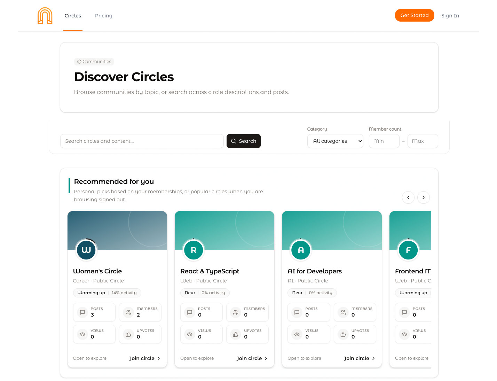
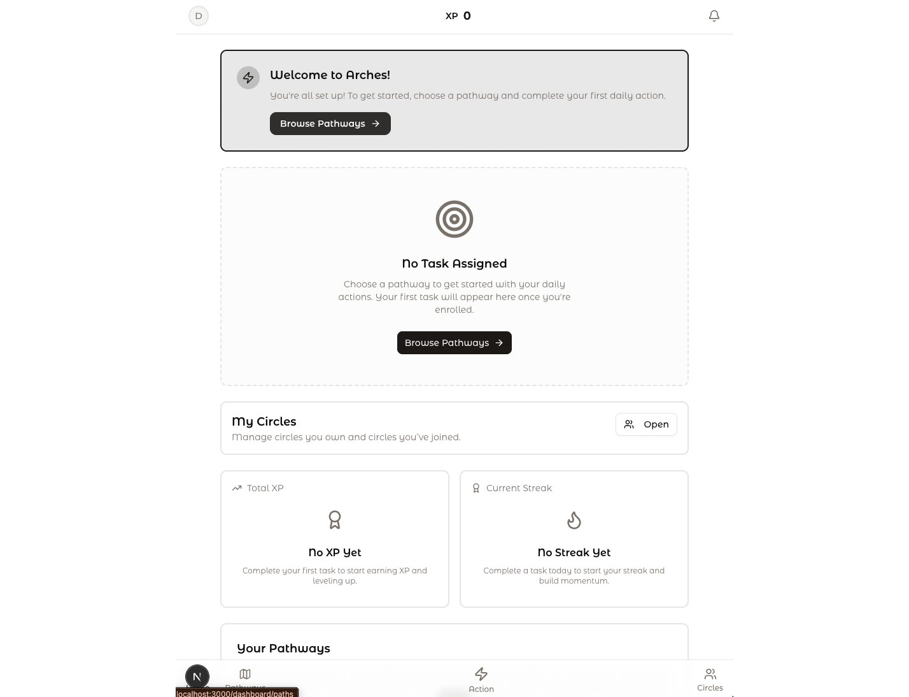
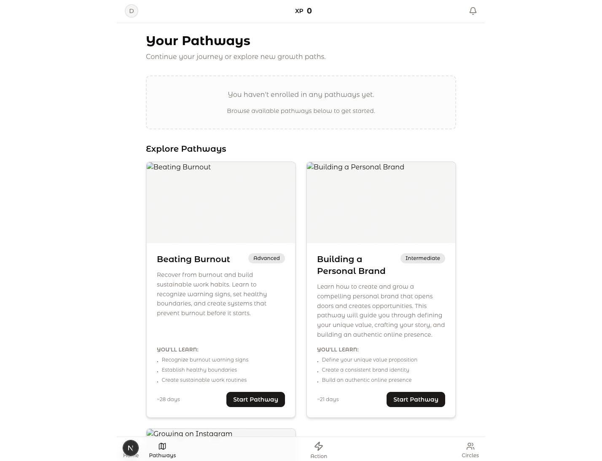
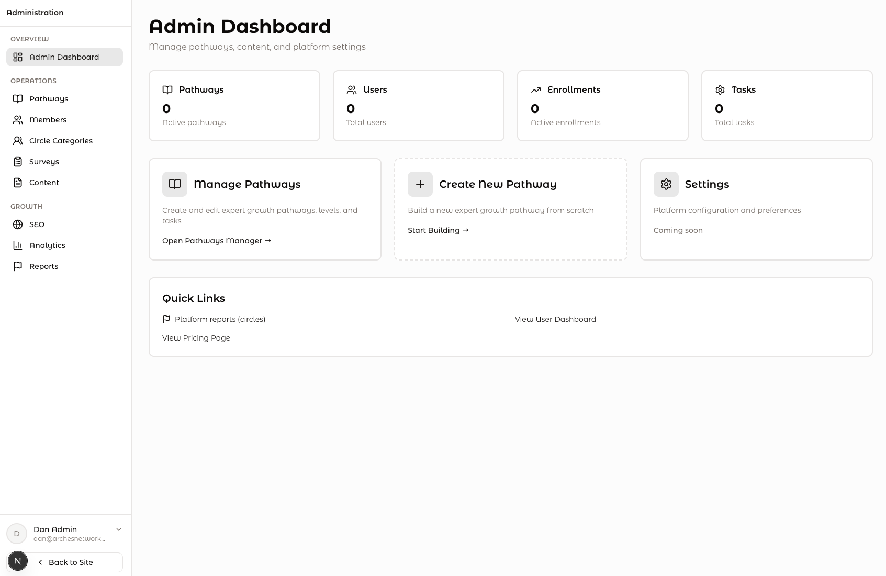

#  Arches Network

Arches is a product and engineering exploration of a platform designed around structured expert growth. Rather than centering on passive course consumption, the platform organizes progress into pathways, levels, and daily tasks, supported by community features such as circles, moderation workflows, and paid access models.

This repository is shared as a work sample. It reflects how I think about product architecture, domain modeling, and fullstack system design in a real-world build.  This is a project under development and has not been released to the world yet. 

---

## What This Project Demonstrates

- End-to-end product engineering (frontend, backend, data modeling)
- Next.js App Router architecture with TypeScript
- Supabase-backed authentication and relational data modeling
- Role-based access control and subscription-aware permissions
- Community workflows (posts, moderation, sharing)
- Structured progression systems (pathways, levels, tasks)
- Reusable UI patterns and system-driven frontend design

---

## My Role


I led the design and development of this project end-to-end, including:

- Product concept and system architecture
- Frontend and backend implementation
- Database schema and workflow modeling
- Design system direction and UI patterns
- Integration of authentication, payments, and monitoring

---

## Featured Code Paths

This repository is broad, but these areas best represent how I think as an engineer:

### 1. Permission & Access Model (Circles)
`src/lib/utils/circles/access-control.ts`

A role- and lifecycle-aware access system supporting free, subscription, and paid community models. This demonstrates how product rules can be translated into a scalable and maintainable permission structure.

---

### 2. Post Creation & Moderation Workflow
`src/app/api/circles/[id]/posts/route.ts`  
`src/app/api/circles/[id]/content/share/route.ts`

API design for content creation, moderation, mention handling, and sharing workflows. This reflects how I approach building systems that balance user experience with platform integrity.

---

### 3. Pathways & Task Assignment Model
`src/lib/pathways/queries.ts`  
`src/lib/pathways/task-assignment.ts`

Core domain modeling for structured growth pathways, including enrollment, level progression, and task assignment. This represents the foundational system behind the product’s learning model.

---

## Architecture Overview

- **Frontend:** Next.js (App Router), React, TypeScript, Tailwind CSS
- **Backend/Data:** Supabase (Postgres, Auth)
- **Payments:** Stripe
- **Monitoring:** Sentry

### Core Systems

- **Circles:** Community spaces with role-based access and moderation
- **Content Engine:** Posts, sharing, mentions, and approval workflows
- **Pathways Engine:** Structured progression via pathways → levels → tasks
- **Admin Tools:** Management of pathways, tasks, and system configuration

---

## Key Engineering Decisions

- Modeled permissions explicitly rather than scattering access logic across components
- Designed domain logic to be reusable across API routes and UI layers
- Structured pathways as hierarchical progression (pathway → level → task)
- Prioritized iteration speed while maintaining system clarity and extensibility
- Used Supabase for rapid backend iteration with strong relational modeling

---

## Screenshots

_Screenshots showcasing the product experience_

Examples:

##### Homepage


##### Circles directory




##### Logged-in Interface




##### Pathway or dashboard view




##### Admin interface 



---

## 🚀 Running Locally

### Prerequisites
- Node.js
- npm or yarn
- Supabase project
- Stripe account (optional for full functionality)

### Setup

```bash
npm install
npm run dev